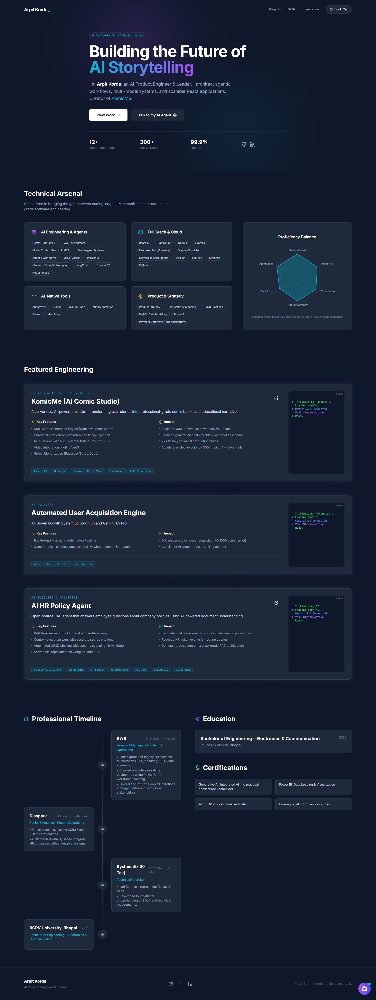

# AI Portfolio Template

A modern, AI-powered developer portfolio template featuring a voice-enabled AI assistant, dynamic content generation from your resume, and Google Calendar integration.

 
*(Note: You'll need to add a screenshot here)*

## features

- **AI Assistant**: A fully functional RAG-like chat agent that answers questions about your experience, projects, and skills.
- **Voice Mode**: Speak to the AI agent with a live audio visualizer.
- **Resume Extractor**: Automated script (`npm run generate-profile`) to parse your resume and populate the portfolio.
- **Dynamic Content**: All sections (Hero, Experience, Projects, Skills) are powered by a single JSON file.
- **Booking Integration**: Direct integration with Google Calendar Appointment Scheduling.
- **Modern UI**: Built with React, Tailwind CSS, Framer Motion, and Lucide Icons.

## ✅ Prerequisites

- Node.js (v18+)
- Google Cloud Project with **Gemini API** enabled
- A PDF or Text version of your Resume

## 🚀 Quick Start

1.  **Clone the Repository**
    ```bash
    git clone https://github.com/yourusername/Portfolio-AI_Agent.git
    cd Portfolio-AI_Agent
    ```

2.  **Install Dependencies**
    ```bash
    npm install
    ```

3.  **Setup Environment Variables**
    Create a `.env` file in the root directory:
    ```bash
    VITE_GEMINI_API_KEY=your_gemini_api_key_here
    ```

4.  **Generate Your Profile**
    Place your resume file (e.g., `resume.pdf`) in the root directory.
    Run the generation script:
    ```bash
    # Usage: node scripts/generate-profile.js <path-to-resume> <api-key>
    node scripts/generate-profile.js ./resume.pdf your_gemini_api_key_here
    ```
    This will create `src/data/profile.json`.

5.  **Run Locally**
    ```bash
    npm run dev
    ```
    Visit `http://localhost:5173` to see your portfolio!

## ⚙️ Configuration

### 1. Profile Data (`data/profile.json`)
The `generate-profile.js` script populates most of this, but you can manually edit `data/profile.json` to fine-tune your content.
- **headline**: Used in the Hero section.
- **contact_info.calendar**: Add your Google Calendar Appointment Schedule link here to enable the "Book Meeting" feature.

### 2. Site Config (`constants.ts`)
This file exports the configuration used throughout the app. It automatically imports from `profile.json`. You usually don't need to touch this unless you want to change the logic.

### 3. Customize Colors & Styles
Edit `tailwind.config.js` to change the `accent`, `primary`, and `secondary` colors.

## 📦 Deployment

### Vercel / Netlify
1.  Push your code to GitHub.
2.  Import the project into Vercel/Netlify.
3.  Add `VITE_GEMINI_API_KEY` to the deployment's Environment Variables.
4.  Deploy!

### Docker / Cloud Run
Build the Docker image:
```bash
docker build -t portfolio-template .
```
Run locally:
```bash
docker run -p 8080:8080 -e VITE_GEMINI_API_KEY=your_key portfolio-template
```

## 🤝 Contributing
Contributions are welcome! Please open an issue or submit a pull request.

## 📄 License
MIT
